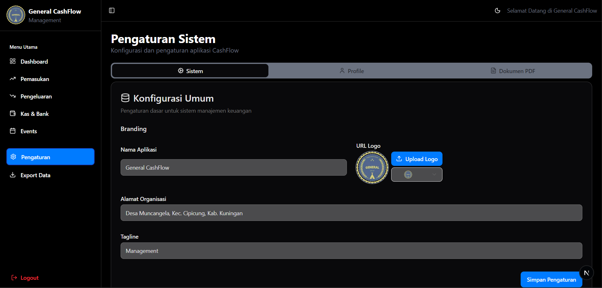
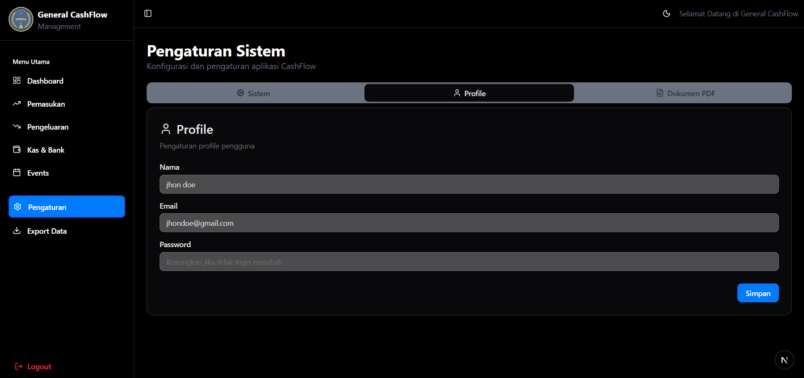
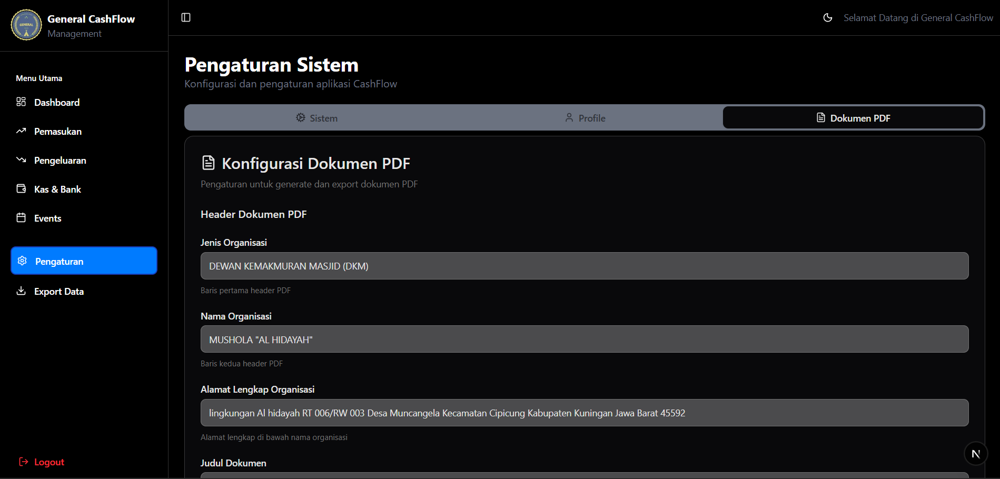
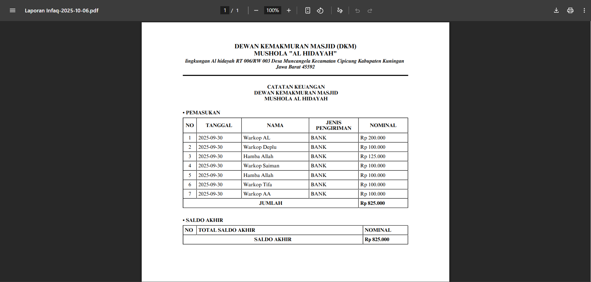

# 💰 General Cash Flow

General Cash Flow adalah aplikasi fullstack untuk mencatat pemasukan, pengeluaran, dan menghasilkan laporan keuangan bulanan.  
Dibangun dengan **Next.js, Supabase, Auth.js, Zustand, Tailwind, dan Shadcn**.

## 🚀 Tech Stack
- [Next.js (App Router)](https://nextjs.org/)
- [Supabase](https://supabase.com/) (Database)
- [Auth.js](https://authjs.dev/) (Authentication)
- [Zustand](https://zustand-demo.pmnd.rs/) (State Management)
- [React Query](https://tanstack.com/query/latest) (Server State Management & Data Fetching)
- [TailwindCSS](https://tailwindcss.com/) + [Shadcn](https://ui.shadcn.com/)

## ✨ Features
- 🔑 User Authentication (Login, Register, Logout)
- 📊 Dashboard: ringkasan cash in, cash out, saldo akhir
- 💸 CRUD transaksi (tambah, edit, hapus)
- 🗂 Laporan bulanan dengan filter
- 📤 Export laporan ke PDF, CSV, EXCEL
- 🌙 Dark mode support

## 📸 Screenshots
### Dashboard


#### Dashboard Setting




### Laporan


## ⚡️ Setup & Installation
```bash
git clone https://github.com/lindanmaulana/General-App
cd General-App
npm install
npm run dev
